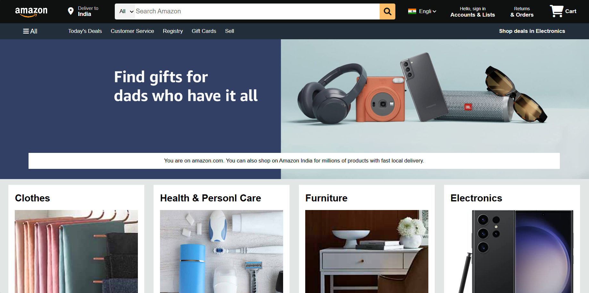
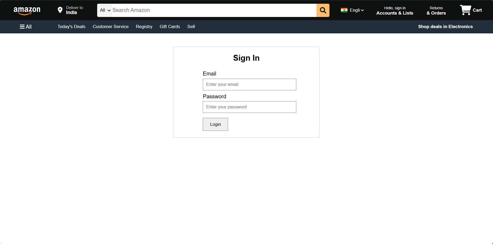
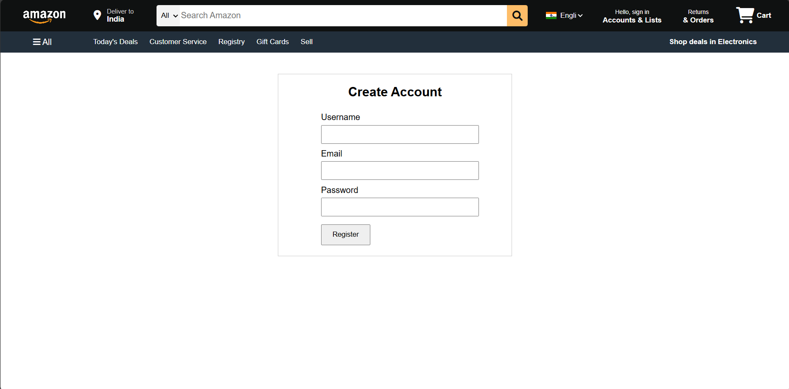

# Amazon Clone Frontend Project

This is a frontend project that replicates the Amazon website's user interface. It is built using HTML, CSS, and JavaScript.

## Project Description

The Amazon Clone frontend project aims to provide a similar look and feel to the original Amazon website. It includes various features such as a navigation bar, search functionality, product listings, and user authentication forms (login and registration).

## Features

- **Navigation Bar**: Includes links to different sections such as Today's Deals, Customer Service, Registry, Gift Cards, and Sell.
- **Search Functionality**: Allows users to search for products across different categories.
- **Product Listings**: Displays various product categories such as Clothes, Health & Personal Care, Furniture, Electronics, Beauty Picks, Pet's Care, Toys, and Gaming Accessories.
- **User Authentication**: Includes login and registration forms for user authentication.
- **Responsive Design**: The layout is responsive and adjusts to different screen sizes.

## Technologies Used

- **HTML**: For the structure of the web pages.
- **CSS**: For styling the web pages.
- **JavaScript**: For adding interactivity to the web pages.

## How to Run

1. Clone the repository to your local machine.
2. Open the `index.html` file in your web browser to view the homepage.
3. Navigate to the login and registration pages using the links in the navigation bar.

## Author

- **Name**: Shaik Abdul Munawar
- **LinkedIn**: [Shaik Abdul Munawar](https://www.linkedin.com/in/shaik-abdul-munawar-b35821284)

## Screenshots
**Homepage**

**Login Page**

**Register Page**

## License

This project is licensed under the MIT License.
